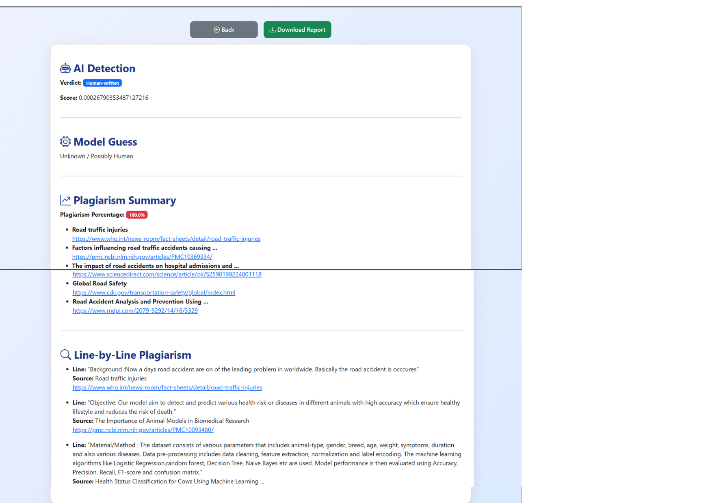

# AICheckMate


# AICheckMate

**AICheckMate** is an AI-powered platform that helps you detect whether content is AI-generated or human-written. It also checks for plagiarism, identifies the percentage of plagiarized content, and shows the source platforms where the content might have been copied from.  

This project is built using **HTML, CSS, Bootstrap, JavaScript, and Python**. It integrates **SAPLING_API** for AI content detection and **SERP_API** for plagiarism/source tracking.  

---

## Features

- ✅ Detect if content is AI-generated or human-written  
- ✅ Check plagiarism percentage in the content  
- ✅ Identify the source/platform from where content may be copied  
- ✅ User-friendly interface built with Bootstrap  
- ✅ Fast and accurate results using SAPLING_API and SERP_API  

---

## Technologies Used

- **Frontend:** HTML, CSS, Bootstrap, JavaScript  
- **Backend:** Python (Flask or Django)  
- **APIs:**  
  - SAPLING_API – AI content detection  
  - SERP_API – Plagiarism and source tracking  

---

## Installation

1. Clone the repository:
    ```bash
    git clone https://github.com/yourusername/AICheckMate.git
    ```
2. Navigate to the project directory:
    ```bash
    cd AICheckMate
    ```
3. Install the required Python packages:
    ```bash
    pip install -r requirements.txt
    ```
4. Set your API keys in a `.env` file:
    ```
    SAPLING_API_KEY=your_sapling_api_key
    SERP_API_KEY=your_serp_api_key
    ```
5. Run the application:
    ```bash
    python app.py
    ```
6. Open your browser and go to `http://localhost:5000` to use the platform.  

---

## Usage

1. Enter or paste the content or Upload files in **PDF, DOC/DOCX, or TXT** format
2.  which you want to check.  
3. Click on **Check Content**.  
4. View the results:  
    - AI detection score  
    - Plagiarism percentage  
    - Source platforms (if content is copied)  

---

## API Key Setup

- **SAPLING_API:** Sign up at [Sapling.ai](https://sapling.ai) to get your API key.  
- **SERP_API:** Sign up at [SerpApi](https://serpapi.com/) to get your API key.  

---

## Screenshots

**Input Page:**  


**Result Page:**  


---

## License

This project is licensed under the MIT License.  

---

## Author

**Aditya Mishra**  
- GitHub: [https://github.com/yourusername](https://github.com/yourusername)  
- LinkedIn: [https://linkedin.com/in/yourprofile](https://linkedin.com/in/yourprofile)  

---

**AICheckMate** – Detect AI content, prevent plagiarism, and ensure originality!

